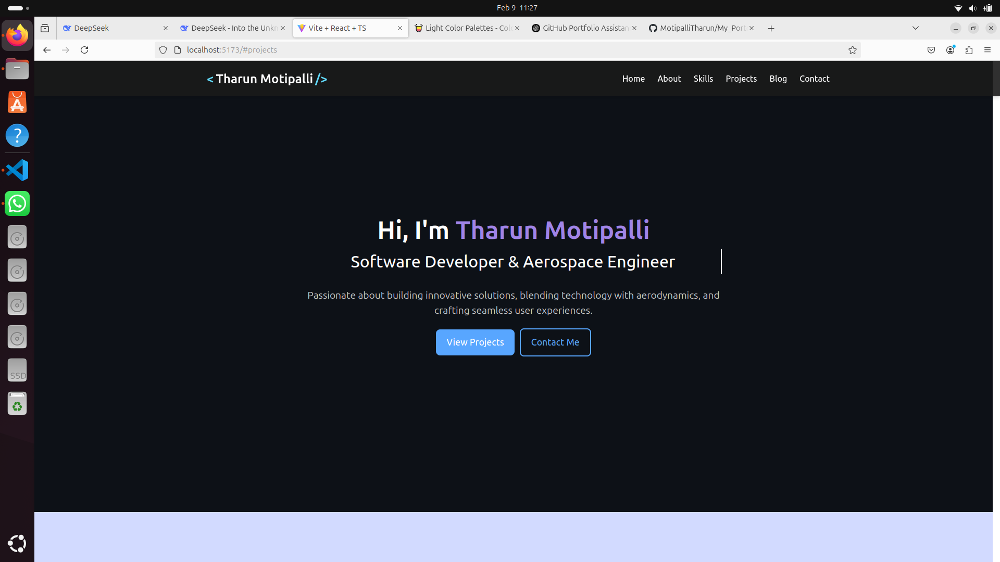

# My Portfolio

  <!-- Replace this with the correct path to your image -->

Welcome to my personal portfolio! This repository showcases my projects, skills, and experiences as a software developer. Below, you'll find more information about me and the work I've done.

## Table of Contents

- [About Me](#about-me)
- [Skills](#skills)
- [Projects](#projects)
- [Contact](#contact)

## About Me

I am a passionate software developer with experience in building full-stack web applications. I specialize in technologies like React, Node.js, MongoDB, and GraphQL. You can check out my projects below and feel free to reach out to me if you have any questions.

## Skills

- **Languages**: JavaScript, Python, C++
- **Frameworks**: React, Node.js, Express
- **Databases**: MongoDB, SQL
- **Tools**: Git, Docker, Webpack
- **Other**: REST APIs, GraphQL, Agile Development

## Projects

### [Project 1: Project Title](link-to-project)
Description of the project and technologies used.

### [Project 2: Project Title](link-to-project)
Description of the project and technologies used.

### [Project 3: Project Title](link-to-project)
Description of the project and technologies used.

## Contact

Feel free to reach out to me via:

- **Email**: your.email@example.com
- **LinkedIn**: [Your LinkedIn Profile](https://linkedin.com/in/your-profile)
- **GitHub**: [Your GitHub](https://github.com/MotipalliTharun)

---

Thank you for visiting my portfolio!
